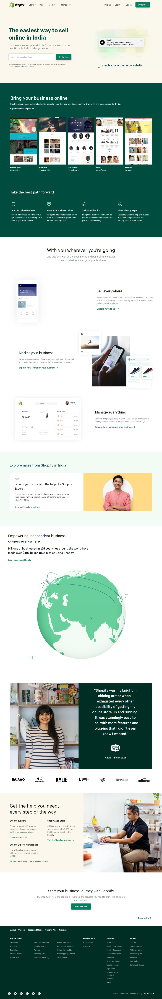

# Shopify clone

Hi 👋 I am Shobhan Sundar Goutam. This project is made with the help of `HTML`, `CSS` and `Tailiwnd CSS`.

 

 

- ### Learnings from this project:-

  - Learned to use Tailwind CSS and how to create fast responsive websites with the help of it.
  - Learned to make different sections responsive with breakpoints more precisely.

- It took around _13 hours_ to complete.

### Screenshot

- Live Link:- [Shopify clone](https://shopify-clone-fsjs.netlify.app/)
